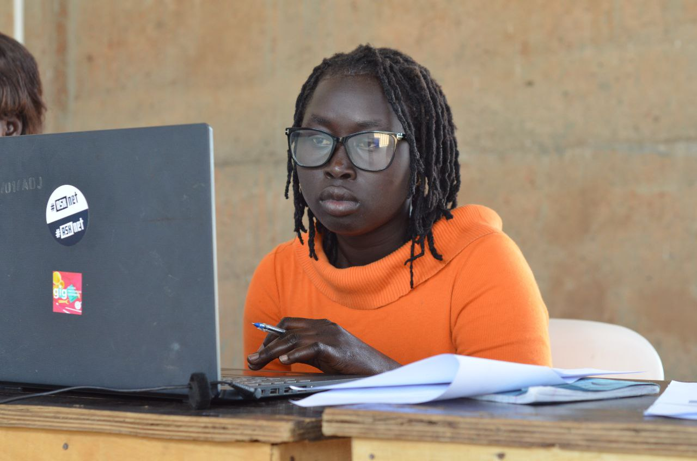

# Who-is-Who-at-ASKnet-project-2021-2022-under-Digital-Tech-Boot-Camp-Low-Tech-Project-
Digital Tech Boot Camp:is an innitiative and training opportunity for young people with basic computer knowledge to learn programming languages and build products to solve local challenges
And also to fully understand the functionalities of knowledge sharing such as software applications like GitHub,build websites for information sharing.
By saying who is who,we mean those who attended the training during this project duration 

# 1.Wafela Andrew(chardso)(Dr device)
    
- GitHub participant
    
- Hardware expert
    
- lead expert
    
- open hardware makers (participant)
    
- member of #ASKnet
    
- member of GIG (Global Innovation Gathering)
- TOT hardware and repair

# 2.Dut Andrew kulang.
- GitHub participant
- lead expert
- member of # ASKnet
- member of GIG (Global Innovation Gathering)
- participant tech boot camp and podcasts.
  
# 3.Asienzo Scovia
- Boot camp participant
- Comedian at mizlight comedy  

# 4.Aya Beatrice
- Tech bootcamp participant

# 5.maridio Janet
- Boot camp participant

# 6.Ocen Patrick
- Tech boot camp participant

# 7.Catherine
- TOT website for low tech bootcamp.

# 8.Duku Godfrey
- Tech boot camp participant
# 9.Duku Patrick
- participant podcast
# 10.Amoko Joseph
- participant podcast
# 11.Amanyara Allan
- GitHub participant

